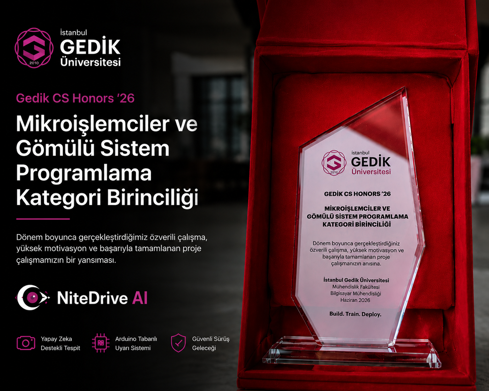

# NiteDrive AI

AI-powered real-time driver drowsiness detection and Arduino-based alert system.

---

## Achievement

🏆 **Winner — Gedik CS Honors'26**  
*Mikroişlemciler ve Gömülü Sistem Programlama* (Microprocessors and Embedded Systems Programming Category)



---

## Project Overview

NiteDrive AI combines computer vision, machine learning, and embedded systems to detect driver fatigue in real time and trigger visual/audio alerts using Arduino.

The system captures a live camera feed, extracts facial and eye landmarks with MediaPipe, computes drowsiness indicators (EAR, PERCLOS, blink patterns, head pose), classifies risk with a Random Forest model, and sends serial commands to an Arduino Uno that drives LEDs and a buzzer.

---

## Key Features

- Real-time driver monitoring
- Face and eye landmark detection (MediaPipe Face Mesh)
- EAR and PERCLOS analysis
- Blink count and blink duration tracking
- Head angle estimation
- Random Forest based classification
- Arduino LED and buzzer alert system
- Streamlit-based monitoring dashboard

---

## Technologies Used

| Layer | Stack |
|-------|-------|
| Language | Python 3.10+ |
| Vision | OpenCV, MediaPipe |
| ML | Scikit-learn, Random Forest |
| Dashboard | Streamlit, Plotly, Pandas |
| Embedded | Arduino Uno, Serial (pyserial) |

---

## System Workflow

```
Camera Input
    → OpenCV Processing
    → MediaPipe Face Landmarks
    → Feature Extraction (EAR, PERCLOS, blink, head)
    → Random Forest Classification
    → Risk Analysis (SAFE / WARNING / DANGER)
    → Arduino Serial Communication
    → LED & Buzzer Alert
```

---

## Project Structure

```
NiteDrive-AI/
│
├── README.md
├── requirements.txt
├── .gitignore
│
├── app.py                      # Streamlit dashboard entry point
├── ai_live_arduino.py          # Live detection + Arduino pipeline
├── run.sh                      # One-command launcher
├── preflight.py                # Environment checks
│
├── src/
│   ├── camera.py               # Webcam capture and frame utilities
│   ├── face_tracking.py        # MediaPipe landmarks & frame tracker
│   ├── feature_extraction.py   # EAR, PERCLOS, ML feature columns
│   ├── model_prediction.py     # Fatigue score & alert smoothing
│   ├── arduino_serial.py       # SAFE / WARNING / DANGER serial protocol
│   └── utils.py                # Preflight helpers
│
├── nitedrive_pages/            # Streamlit multi-page UI
├── nitedrive_theme.py
├── nitedrive_components.py
├── dm_metrics.py               # Dashboard metrics layer
├── dm_alerts.py
│
├── arduino/
│   └── nitedrive_alert_system.ino
│
├── assets/
│   ├── nitedrive_logo.png
│   ├── birincilik_resmi.png
│   ├── system_flow_diagram.png
│   └── demo_thumbnail.png
│
├── docs/
│   └── presentation_notes.md
│
└── demo/
    └── demo_video_link.txt
```

---

## Installation

```bash
git clone https://github.com/emrekayy/NiteDrive-AI.git
cd NiteDrive-AI

python -m venv venv
source venv/bin/activate        # Windows: venv\Scripts\activate
pip install -r requirements.txt
```

---

## Usage

### Streamlit dashboard

```bash
streamlit run app.py
```

Open **http://localhost:8501** and navigate to **Canlı İzleme Paneli** for the live monitoring view.

### Live detection + Arduino

```bash
./run.sh              # PC camera
./run.sh phone        # Phone camera (USB webcam mode)
```

The live pipeline writes shared state to `.nitedrive_live.json` and `.nitedrive_live.jpg` for the dashboard.

### Model training (optional)

```bash
python train_model.py
```

---

## Arduino Setup

Firmware: `arduino/nitedrive_alert_system.ino`

Upload to Arduino Uno via Arduino IDE. Serial protocol: `SAFE`, `WARNING`, or `DANGER` (one line per command, 9600 baud).

| Component | Pin |
|-----------|-----|
| Buzzer | Digital pin **8** |
| LED (SAFE) | Digital pin **9** |
| LED (WARNING) | Digital pin **10** |
| LED (DANGER) | Digital pin **11** |
| GND | Common ground |

---

## Demo

Demo video: see [`demo/demo_video_link.txt`](demo/demo_video_link.txt)

> Demo video will be shared via LinkedIn or external video link.

---

## Team

- [Emre Kaya](https://github.com/emrekayy)
- Tarık Turhan
- Abbosbek Ismonaliev

---

## Acknowledgements

Gedik University Computer Engineering Department and project instructors.

---

*NiteDrive AI — Stay awake. Stay safe. Arrive home.*
